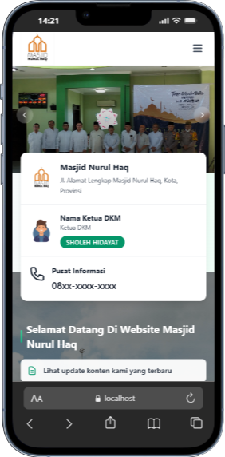
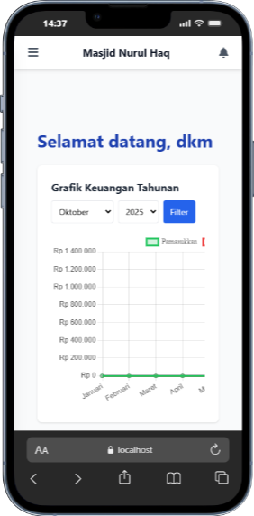
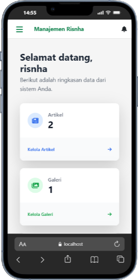
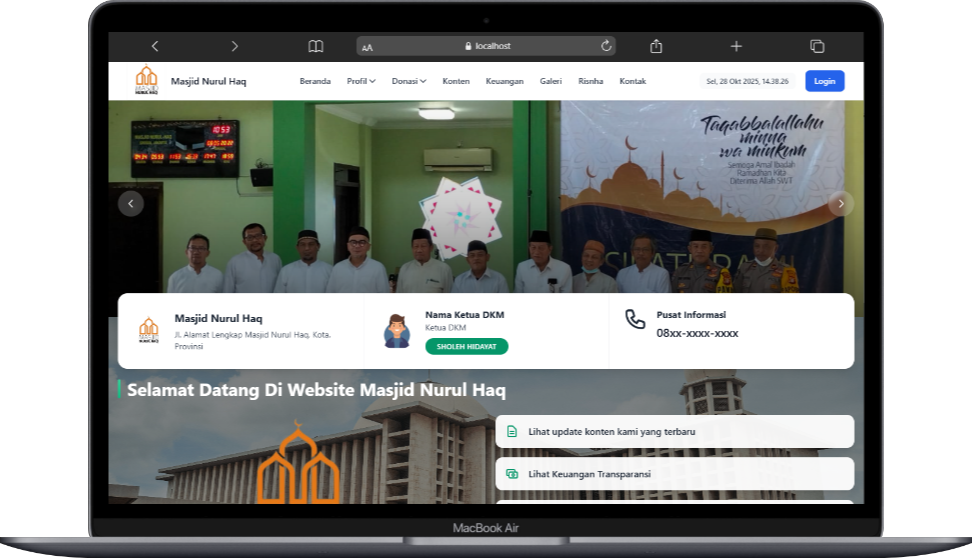
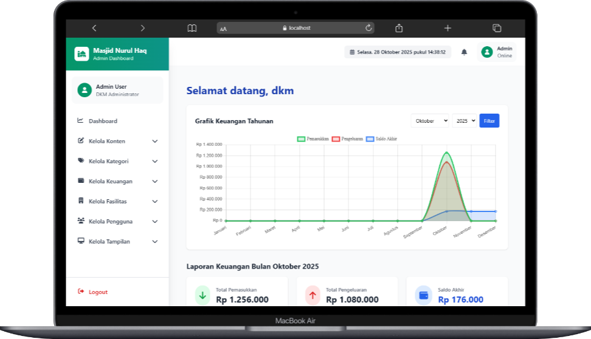
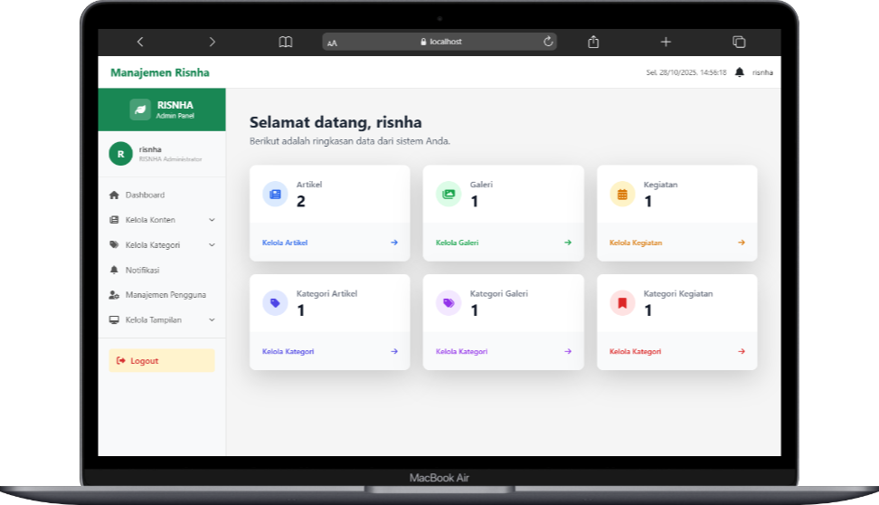

# Sistem Informasi Masjid Nurul Haq
## Selamat datang di repositori Sistem Informasi Masjid Nurul Haq. Ini adalah aplikasi web monolithic yang dibangun menggunakan Laravel untuk mengelola semua aspek informasi, kegiatan, dan keuangan masjid.

Aplikasi Web ini memiliki tiga peran pengguna utama:

Pengguna Umum (Jamaah): Dapat melihat informasi publik.

Admin DKM (Dewan Kemakmuran Masjid): Pengelola utama website.

Admin RISNHA (Remaja Islam Masjid Nurul Haq): Pengelola untuk bagian organisasi remaja masjid.

### Fitur Utama
1. Fitur Publik (Pengguna Masjid)
- Homepage: Menampilkan carousel dinamis, running text, dan ringkasan konten terbaru.
- Konten Masjid: Melihat daftar dan detail kegiatan serta artikel yang dipublikasikan oleh DKM.
- Keuangan Masjid: Laporan keuangan transparan dengan rincian pemasukkan dan pengeluaran.
- Galeri: Melihat galeri foto kegiatan masjid.
- Profil Masjid: Halaman untuk melihat Sejarah serta Visi & Misi masjid.
- Donasi: Halaman untuk informasi donasi, formulir kirim bukti transfer, dan melihat donasi yang telah terverifikasi.
- Jadwal Sholat: Menampilkan jadwal sholat harian (melalui API internal).
- Halaman Khusus RISNHA: Portal terpisah untuk melihat konten, galeri, dan profil RISNHA.

2. Panel Admin DKM
- Autentikasi: Login dan Logout khusus untuk DKM.
- Dashboard: Menampilkan ringkasan statistik website.
    - Manajemen Konten:
        - CRUD (Create, Read, Update, Delete) untuk Kegiatan Masjid.
        - CRUD untuk Artikel Masjid.
        - CRUD untuk Jadwal Imam (harian/Jumat).
        - Fitur Publish/Unpublish dan Preview konten.
    - Manajemen Keuangan:
        - CRUD untuk Pemasukkan.
        - CRUD untuk Pengeluaran.
        - Manajemen Kategori untuk Keuangan (Pemasukkan & Pengeluaran).
    - Manajemen Fasilitas:
        - CRUD untuk Galeri.
    - Manajemen Kategori: 
        - Mengelola kategori untuk Konten dan Galeri.
    - Verifikasi Donasi: 
        - Admin dapat memverifikasi atau menolak bukti donasi yang dikirim oleh jamaah.
    - Manajemen Tampilan:
        - Mengatur gambar carousel dan running text di halaman utama.
        - Mengedit konten halaman Sejarah dan Visi & Misi.
        - Manajemen Pengguna:
        - CRUD untuk akun DKM dan RISNHA.
- Fitur Verifikasi PIN untuk mengakses menu sensitif (Manajemen Pengguna).
- Notifikasi: Melihat notifikasi (misalnya, donasi baru masuk).
- Backup Data: Fitur untuk melakukan backup database.

3. Panel Admin RISNHA
- Autentikasi: Login dan Logout khusus untuk RISNHA.
- Dashboard: Menampilkan ringkasan statistik RISNHA.
- Manajemen Konten RISNHA:
- CRUD untuk Kegiatan RISNHA.
- CRUD untuk Artikel RISNHA.
- CRUD untuk Galeri RISNHA.
- Manajemen Kategori RISNHA: Mengelola kategori khusus untuk konten RISNHA.
- Manajemen Pengguna RISNHA: Mengelola akun anggota RISNHA.
- Manajemen Profil RISNHA:
- Mengedit Visi & Misi RISNHA.
- Mengatur Struktur Organisasi RISNHA.
- Notifikasi: Melihat notifikasi terkait RISNHA.

## Tumpukan Teknologi (Tech Stack)
- Framework: Laravel 12
- Bahasa: PHP
- Database: MySQL (Asumsi, berdasarkan standar Laravel)
- Frontend: Blade Templates, Tailwind CSS, AlpineJs, Trix Css, Chart Js.
- Bundler: Vite
- Lainnya: Composer, NPM

> [!NOTE]
> Sebelum memulai, pastikan Anda telah menginstal perangkat lunak berikut:
> PHP (disarankan versi 8.1 atau lebih baru)
> Composer
> Node.js & NPM
> Database (misal: MySQL, MariaDB)
> Git

## Tampilan Layar
> Berikut ini beberapa tampilan yang sudah dibuat.
### Screenshot

