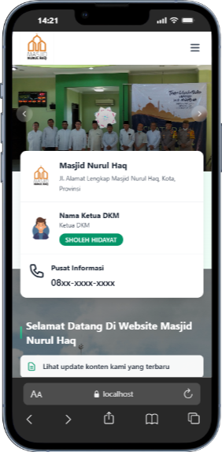
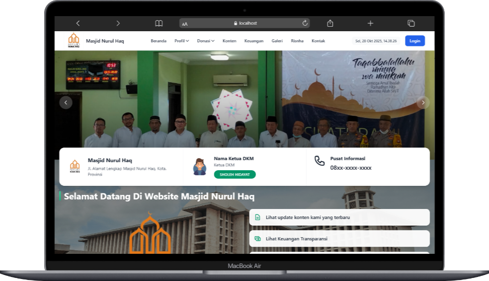
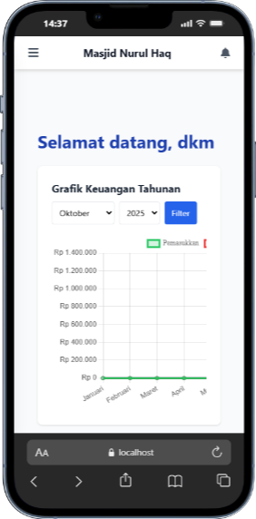
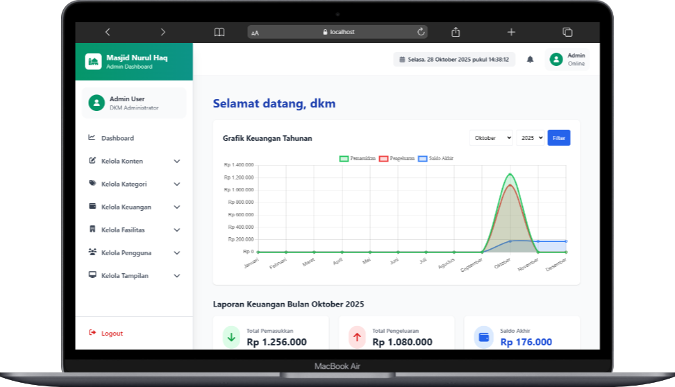
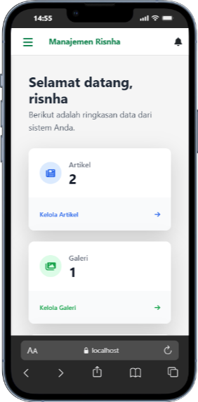
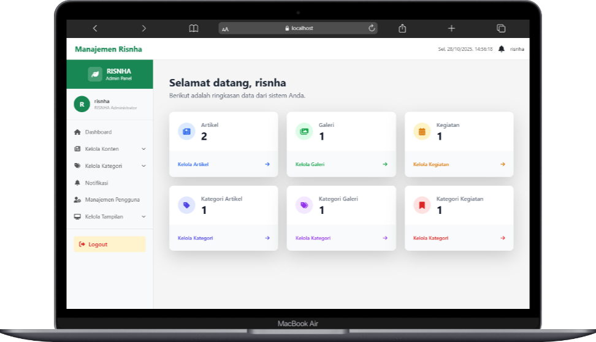

# Sistem Informasi Masjid Nurul Haq

## 📌 Pengenalan Aplikasi

Selamat datang di repositori **Sistem Informasi Masjid Nurul Haq**! Ini adalah aplikasi web monolithic yang dibangun menggunakan **Laravel 12** untuk mengelola seluruh aspek informasi, kegiatan, keuangan, dan organisasi Masjid Nurul Haq.

Aplikasi ini dirancang untuk memberikan **transparansi**, **kemudahan akses informasi**, dan **manajemen yang efisien** dengan tiga peran pengguna utama:

- 👥 **Pengguna Umum (Jamaah)**: Dapat mengakses informasi publik tentang masjid, kegiatan, keuangan, dan melakukan donasi.
- 🔐 **Admin DKM (Dewan Kemakmuran Masjid)**: Pengelola utama website dengan akses penuh ke manajemen konten, keuangan, dan user.
- 🎓 **Admin RISNHA (Remaja Islam Masjid Nurul Haq)**: Pengelola khusus untuk organisasi remaja dengan konten dan dashboard tersendiri.

---

## 🎯 Fitur Utama

### 1️⃣ **Portal Publik (Pengguna Masjid/Jamaah)**

#### 🏠 **Homepage & Navigasi**
- Dashboard utama dengan carousel dinamis menampilkan berita terbaru
- Running text untuk pengumuman penting
- Widget jadwal imam sholat harian
- Navigasi menu yang intuitif ke semua fitur publik

#### 📰 **Manajemen Konten**
- **📌 Kegiatan Masjid**: 
  - Lihat daftar semua kegiatan yang dipublikasikan
  - Detail lengkap kegiatan dengan gambar, deskripsi, dan tanggal
  - Filter berdasarkan kategori kegiatan
  
- **📖 Artikel & Blog**:
  - Baca artikel & berita dari DKM
  - Konten yang dapat difilter berdasarkan kategori
  - Full article view dengan formatting teks lengkap

#### 💰 **Laporan Keuangan Transparan**
- **Ringkasan Keuangan**: Overview total pemasukkan vs pengeluaran
- **Detail Pemasukkan**: 
  - Breakdown semua sumber pemasukkan (donasi, zakat, infaq, dll)
  - Filter per kategori dan periode waktu
  - Tampilan tabel dan chart visual
  
- **Detail Pengeluaran**: 
  - Breakdown detail pengeluaran operasional
  - Filter per kategori (operasional, pemeliharaan, dll)
  - Transparansi penuh untuk kepercayaan jamaah

#### 📸 **Galeri Foto**
- Galeri foto kegiatan-kegiatan masjid
- Kategorisasi foto (acara, pemeliharaan, dll)
- Interface responsif untuk desktop dan mobile

#### 🕌 **Profil & Informasi Masjid**
- **Sejarah**: Latar belakang dan sejarah pendirian Masjid Nurul Haq
- **Visi & Misi**: Visi dan misi masjid dalam menjalankan fungsinya
- **Struktur DKM**: Jajarah pembina dan struktur organisasi DKM dengan foto

#### 💝 **Sistem Donasi (Terintegrasi Midtrans)**
- **Form Donasi Interaktif**:
  - Pilih nominal preset (Rp 10.000, 50.000, 100.000, 500.000) atau masukkan custom
  - Input nama donatur (opsional untuk donasi anonim)
  - Pesan/doa untuk donatur (opsional)
  
- **Pembayaran Aman**:
  - Terintegrasi dengan **Midtrans Payment Gateway** (Sandbox)
  - Support multiple metode pembayaran: kartu kredit, transfer bank, e-wallet, dll
  - Proses pembayaran yang aman dan terenkripsi
  
- **Donasi Manual**:
  - Form kirim bukti transfer untuk donasi manual
  - Upload foto bukti transfer
  - Status tracking donasi (pending → verified/rejected)
  
- **Hasil Donasi**:
  - Lihat daftar donasi yang telah diverifikasi (public transparency)
  - Nama donatur dan nominal (jika tidak anonim)

#### 🤲 **Sistem Muhasabah (Self-Assessment)**
- **Login Muhasabah**: Akses khusus untuk anggota grup muhasabah
- **Dashboard Penilaian Diri**: 
  - Isi kuesioner self-assessment dengan berbagai tipe pertanyaan
  - Lacak progress penilaian diri
  - Submisi response untuk evaluasi
  
- **Fitur Tambahan**:
  - Sistem grup untuk muhasabah kolektif
  - Pertanyaan dengan berbagai format (pilihan ganda, uraian, skala, dll)

#### 🎓 **Portal RISNHA**
- **Homepage RISNHA**: Portal khusus untuk remaja masjid
- **Konten RISNHA**: 
  - Lihat kegiatan dan artikel khusus RISNHA
  - Filter per kategori RISNHA
  
- **Galeri RISNHA**: Foto-foto kegiatan remaja
- **Profil RISNHA**: 
  - Struktur organisasi RISNHA
  - Visi & misi RISNHA
  
- **Kontak RISNHA**: Informasi kontak untuk tanya jawab

#### 🕐 **API Jadwal Sholat**
- Endpoint `/api/jadwal-sholat-hari-ini` untuk mengakses jadwal sholat harian
- Integrasi dengan berbagai aplikasi pihak ketiga

---

### 2️⃣ **Panel Admin DKM**

#### 🔐 **Autentikasi & Dashboard**
- Login khusus untuk admin DKM dengan session management
- Dashboard dengan statistik lengkap:
  - Total kegiatan, artikel, galeri
  - Ringkasan keuangan (pemasukkan vs pengeluaran)
  - Notifikasi aktivitas terbaru
  - Quick actions untuk manajemen konten

#### 📝 **Manajemen Konten**

**Kegiatan Masjid (CRUD Lengkap)**
- Create kegiatan baru dengan form interaktif
- Edit/Update kegiatan yang ada
- Delete dengan konfirmasi
- Upload gambar kegiatan
- Status publish/draft untuk kontrol akses
- Preview sebelum publish
- Bulk delete capabilities
- Auto-cleanup gambar lama saat update

**Artikel Masjid (CRUD Lengkap)**
- Create artikel dengan rich text editor (Trix)
- Edit/Update konten artikel
- Delete artikel
- Upload featured image
- Status publish/draft
- Preview functionality
- Bulk delete
- Auto-cleanup media

**Jadwal Imam Sholat**
- Create jadwal imam sholat harian (Subuh, Zuhur, Ashar, Maghrib, Isya)
- Create jadwal khusus Jumat
- Edit/Update jadwal
- Delete jadwal
- Kalender view untuk visualisasi

#### 💰 **Manajemen Keuangan**

**Dashboard Keuangan**
- Overview keuangan komprehensif
- Summary total pemasukkan vs pengeluaran
- Chart visualization untuk analisis trend
- Filter per periode waktu

**Pemasukkan (CRUD + Kategorisasi)**
- Create entry pemasukkan dengan kategori
- Input amount, tanggal, deskripsi, keterangan source
- Edit/Update pemasukkan
- Delete dengan konfirmasi
- Bulk delete capabilities
- Kategorisasi otomatis
- Filter per kategori dan periode

**Pengeluaran (CRUD + Kategorisasi)**
- Create entry pengeluaran dengan detail
- Kategori pengeluaran (operasional, pemeliharaan, dll)
- Edit/Update entri
- Delete pengeluaran
- Bulk delete
- Filter dan search functionality
- Tracking tanggal dan jumlah

**Kategori Keuangan (CRUD)**
- Manajemen kategori pemasukkan
- Manajemen kategori pengeluaran
- Create/Edit/Delete kategori
- Kategorisasi otomatis untuk analisis

#### 📸 **Manajemen Galeri**

**Gallery Management (CRUD)**
- Create galeri baru dengan kategori
- Upload multiple gambar per galeri
- Edit judul, deskripsi, kategori
- Delete galeri & foto
- Kategorisasi galeri
- Bulk image upload
- Image optimization

**Kategori Galeri (CRUD)**
- Manajemen kategori galeri (Acara, Pemeliharaan, dll)
- Create/Edit/Delete kategori
- Assign kategori ke galeri

#### 🏷️ **Manajemen Kategori**
- Kategori Kegiatan: Create/Edit/Delete kategori kegiatan
- Kategori Artikel: Manage kategori artikel
- Kategori Galeri: Kelola kategori galeri
- Category hierarchy dan organization

#### ✅ **Verifikasi Donasi**

**Donor Proof Management**
- View pending donasi proof uploads
- Preview bukti transfer (gambar)
- Verify / Reject bukti donasi
- Auto-notification ke jamaah saat verified
- Status tracking (pending → verified/rejected)
- Donasi yang verified tampil di hasil donasi publik

#### 🎨 **Manajemen Tampilan UI**

**Home Sections (Carousel)**
- Manage gambar carousel di homepage
- Add/Edit/Delete carousel sections
- Set order/urutan tampilan
- Image cropping & resizing

**Running Text**
- Create/Edit pengumuman scrolling
- Kelola multiple running text
- Active/inactive toggle
- Jadwal tampilan otomatis

**Visi & Misi**
- Edit visi masjid dengan rich text editor
- Edit misi masjid dengan formatting
- Save & publish changes

**Sejarah Masjid**
- Edit deskripsi sejarah masjid
- Upload gambar sejarah
- Rich text formatting
- Preview perubahan

**Struktur DKM**
- Manage anggota struktur DKM
- Upload foto anggota
- Edit nama dan jabatan
- Arrange struktur organisasi

#### 👥 **Manajemen Pengguna (PIN Protected)**

**Manajemen Admin DKM**
- Create akun DKM baru
- Edit username/password DKM
- Delete akun DKM
- Status aktivasi/deactivasi
- Role assignments

**Manajemen Admin RISNHA**
- Create akun RISNHA
- Edit RISNHA user credentials
- Delete RISNHA accounts
- Manage permissions

**PIN Verification**
- Fitur keamanan PIN untuk akses menu sensitif
- Proteksi terhadap unauthorized access

#### 🤲 **Manajemen Muhasabah**

**Group Management**
- Create muhasabah group baru
- Edit/Update group information
- Delete group
- Group description & setting

**Member Management**
- Add anggota ke group dengan credentials
- Bulk import anggota (CSV/Excel)
- Edit member username/password
- Delete anggota dari group
- Member status tracking

**Question Management (Advanced)**
- Create soal muhasabah dengan multiple types:
  - Multiple choice questions
  - Short answer questions
  - Scale/rating questions
  - Essay questions
  
- Features:
  - Set required/optional flag
  - JSON-based answer options
  - Question ordering
  - Activate/deactivate questions
  - Edit pertanyaan existing
  - Delete pertanyaan
  - Preview hasil jawaban

**Report & Analytics**
- Lihat laporan muhasabah anggota
- Lihat response per anggota
- Aggregate hasil assessment
- Export laporan (optional)

#### 📢 **Notifikasi System**
- Activity log lengkap (create, update, delete, publish actions)
- Notifikasi donasi (when new proof submitted)
- Notifikasi konten (new article, activity, gallery)
- Auto-cleanup old notifications (default: 30+ hari)
- Bulk delete notifications
- Real-time notification count

#### 💾 **Backup & Maintenance**
- Database backup functionality
- One-click backup feature
- Backup schedule management
- Data recovery capabilities

---

### 3️⃣ **Panel Admin RISNHA**

#### 🔐 **Autentikasi & Dashboard**
- Login khusus untuk RISNHA dengan session management
- Dashboard RISNHA dengan statistik organisasi:
  - Total kegiatan, artikel, galeri RISNHA
  - Member/anggota RISNHA
  - Quick actions khusus RISNHA

#### 📝 **Manajemen Konten RISNHA**

**Kegiatan RISNHA (CRUD)**
- Create kegiatan khusus remaja
- Edit/Update kegiatan
- Delete dengan konfirmasi
- Upload gambar kegiatan
- Status publish/draft
- Full preview functionality
- Bulk operations

**Artikel RISNHA (CRUD)**
- Create artikel organisasi remaja
- Edit/Update konten
- Delete artikel
- Rich text editor dengan formatting
- Image upload
- Category assignment
- Publish/draft status
- Preview sebelum publish

**Galeri RISNHA (CRUD)**
- Photo gallery khusus RISNHA
- Create galeri baru
- Upload multiple foto
- Edit galeri information
- Delete galeri & foto
- Category management
- Image optimization

#### 🏷️ **Manajemen Kategori RISNHA**
- Kategori Kegiatan RISNHA
- Kategori Artikel RISNHA
- Kategori Galeri RISNHA
- Full CRUD untuk setiap kategori

#### 👥 **Manajemen Pengguna RISNHA**
- Create akun anggota RISNHA
- Edit username/password member
- Delete member account
- Suspend/Activate member
- Member profile information

#### 🏛️ **Manajemen Profil RISNHA**

**Vision & Mission**
- Edit Visi RISNHA
- Edit Misi RISNHA
- Rich text formatting
- Public display management

**Struktur Organisasi**
- Manage struktur organisasi RISNHA
- Upload foto anggota pengurus
- Edit jabatan dan nama
- Organize hierarchy
- Display struktur di public portal

#### 📢 **Notifikasi RISNHA**
- Activity notifications khusus RISNHA
- Track content changes
- Auto-cleanup old notifications
- Bulk management

#### 🎨 **Homepage Customization**
- Manage RISNHA home sections
- Carousel/featured content
- Quick access sections

---

## 🛠️ Tech Stack

| Komponen | Teknologi | Versi |
|----------|-----------|-------|
| **Framework Web** | Laravel | 12.x |
| **Bahasa Backend** | PHP | 8.1+ |
| **Database** | MySQL / MariaDB | 5.7+ |
| **Frontend** | Blade Templates | - |
| **CSS Framework** | Tailwind CSS | 3.x |
| **JavaScript Framework** | Alpine.js | 3.x |
| **Rich Text Editor** | Trix Editor | - |
| **Chart Library** | Chart.js | 3.x |
| **Asset Bundler** | Vite | 5.x |
| **Package Manager** | Composer / NPM | - |
| **Payment Gateway** | Midtrans | Snap API |
| **Activity Logging** | Spatie Laravel Activity Log | 4.10 |
| **Sitemap** | Spatie Laravel Sitemap | 7.3 |

---

## 📦 Struktur Database

Aplikasi menggunakan **33 models/tables** utama:

### Core Entities
- `users`, `dkms`, `risnhas` - User authentication
- `notifikasi`, `notifikasi_risnha` - Notification system

### Content Management
- `artikels`, `artikel_risnhas` - Articles
- `kegiatans`, `kegiatan_risnhas` - Activities/Events
- `galeris`, `galeri_risnhas` - Photo galleries
- `jadwal_imams` - Prayer leader schedules

### Categorization
- Category tables untuk semua konten (articles, activities, galleries)
- `kategori_pemasukkan`, `kategori_pengeluaran` - Financial categories

### Financial
- `pemasukkans` - Income entries
- `pengeluarans` - Expense entries
- `donasis` - Donation records (Midtrans integrated)

### Organization
- `visi_misis`, `visi_misi_risnhas` - Vision & Mission
- `sejarahs` - Mosque history
- `struktur_dkms` - DKM structure
- `struktur_organisasi_risnhas` - RISNHA structure

### Muhasabah System
- `muhasabah_groups` - Assessment groups
- `muhasabah_anggotas` - Group members
- `muhasabah_soals` - Assessment questions
- `laporan_muhasabah_anggotas` - Assessment responses

### UI Management
- `home_sections`, `home_section_risnhas` - Carousel sections
- `running_texts` - Scrolling announcements

---

## 🚀 Memulai

### Prerequisites
Pastikan sudah menginstall:
- **PHP** 8.1 atau lebih baru
- **Composer** untuk package management
- **Node.js** & **NPM** untuk frontend assets
- **MySQL** atau **MariaDB** untuk database
- **Git** untuk version control

### Installation Steps

```bash
# 1. Clone repository
git clone <repository-url>
cd masjid-nurul-haq

# 2. Install PHP dependencies
composer install

# 3. Install NPM dependencies
npm install

# 4. Setup environment
cp .env.example .env

# 5. Generate application key
php artisan key:generate

# 6. Configure database di .env
# DB_DATABASE=masjid_nurul_haq
# DB_USERNAME=root
# DB_PASSWORD=

# 7. Run migrations
php artisan migrate

# 8. Seed database (optional)
php artisan db:seed

# 9. Build assets
npm run build

# 10. Start development server
php artisan serve
```

### Configuration

**Midtrans Payment Gateway**
```env
MIDTRANS_MERCHANT_ID=your_merchant_id
MIDTRANS_CLIENT_KEY=your_client_key
MIDTRANS_SERVER_KEY=your_server_key
MIDTRANS_IS_PRODUCTION=false  # Set true untuk production
```

**Database**
```env
DB_CONNECTION=mysql
DB_HOST=127.0.0.1
DB_PORT=3306
DB_DATABASE=masjid_nurul_haq
DB_USERNAME=root
DB_PASSWORD=
```

---

## 📁 Struktur Project

```
masjid-nurul-haq/
├── app/
│   ├── Http/
│   │   ├── Controllers/
│   │   │   ├── Dkm/             # DKM admin controllers
│   │   │   ├── Risnha/          # RISNHA admin controllers
│   │   │   ├── PenggunaMasjid/  # Public user controllers
│   │   │   └── Api/             # API controllers
│   │   └── Middleware/
│   └── Models/                   # Eloquent models (33+ models)
├── database/
│   ├── migrations/              # Database migrations
│   ├── seeders/                 # Database seeders
│   └── factories/               # Model factories
├── resources/
│   ├── views/                   # Blade templates
│   ├── css/                     # Tailwind CSS
│   └── js/                      # JavaScript files
├── routes/
│   ├── web.php                  # Web routes
│   └── console.php              # Console commands
├── config/
│   ├── services.php             # Third-party services (Midtrans)
│   └── ...                      # Other configs
└── public/
    ├── bukti_donasi/            # Donation proofs
    ├── images/                  # Images
    └── storage/                 # Symbolic link to storage
```

---

## 🔐 Security Features

- **Authentication**: Session-based untuk DKM, RISNHA, dan Muhasabah groups
- **PIN Protection**: Verifikasi PIN untuk operasi sensitif (user management)
- **Password Hashing**: Bcrypt untuk password encryption
- **CSRF Protection**: Token validation untuk form submissions
- **File Upload Validation**: Type dan size checking untuk uploads
- **Soft Deletes**: Data protection dengan soft delete capability
- **Activity Logging**: Spatie activity log untuk audit trail

---

## 📊 Database Relationships

```
User (DKM)
  ├── Many Artikels
  ├── Many Kegiatans
  ├── Many Galeris
  └── Many Notifikasis

Risnha (Admin)
  ├── Many Artikel Risnhas
  ├── Many Kegiatan Risnhas
  ├── Many Galeri Risnhas
  └── Many Notifikasi Risnhas

Muhasabah Group
  ├── Many Muhasabah Anggotas
  ├── Many Muhasabah Soals
  └── Many Laporan Muhasabah Anggotas

Donasi
  ├── Related to Midtrans transaction
  └── Status: pending/verified/rejected
```

---

## 🎯 Use Cases

### Jamaah/Public User
1. Mengakses informasi kegiatan dan artikel masjid
2. Melihat transparansi keuangan masjid
3. Melakukan donasi melalui Midtrans atau manual
4. Mengikuti self-assessment muhasabah
5. Mengakses informasi khusus RISNHA (remaja)

### Admin DKM
1. Mengelola konten (artikel, kegiatan, galeri, jadwal imam)
2. Mengelola keuangan (pemasukkan, pengeluaran, laporan)
3. Memverifikasi donasi masuk
4. Mengatur tampilan homepage
5. Mengelola akun pengguna
6. Membuat kuesioner muhasabah dan analisis
7. Membuat backup data

### Admin RISNHA
1. Mengelola konten khusus remaja
2. Mengelola struktur organisasi
3. Mengelola anggota RISNHA
4. Publish informasi untuk portal RISNHA

---

## 📱 Responsive Design

Aplikasi didesain untuk bekerja optimal di:
- 📱 **Mobile**: < 640px (Smartphone)
- 🖥️ **Tablet**: 640px - 1024px
- 💻 **Desktop**: > 1024px

Menggunakan **Tailwind CSS** classes dan **Alpine.js** untuk interaksi responsif.

---

## 🖼️ Screenshots

Berikut tampilan aplikasi di berbagai device:

### Homepage



### DKM Admin Panel



### RISNHA Portal



---

## 📞 Support & Contact

Untuk pertanyaan atau issues teknis, silakan:
- 📧 Email: support@masjidnurulhaq.id
- 🌐 Website: www.masjidnurulhaq.id
- 📱 Hubungi DKM Masjid Nurul Haq

---

## 📄 Lisensi

Aplikasi ini dikembangkan untuk Masjid Nurul Haq. Semua hak cipta © 2024 Masjid Nurul Haq.

---

## 🤝 Kontribusi

Kontribusi dan improvement suggestions sangat diterima! Silakan:
1. Fork repository
2. Buat feature branch (`git checkout -b feature/AmazingFeature`)
3. Commit changes (`git commit -m 'Add some AmazingFeature'`)
4. Push ke branch (`git push origin feature/AmazingFeature`)
5. Buka Pull Request

---

## 📝 Changelog

### Version 1.0.0 (Current)
- ✅ Portal publik dengan konten dinamis
- ✅ Panel admin DKM lengkap
- ✅ Panel admin RISNHA
- ✅ Sistem donasi terintegrasi Midtrans
- ✅ Muhasabah assessment system
- ✅ Laporan keuangan transparan
- ✅ Activity logging & notifications
- ✅ Responsive design untuk semua device

---

## 🙏 Terima Kasih

Terima kasih kepada:
- **Laravel Framework** untuk fondasi aplikasi
- **Tailwind CSS** untuk styling
- **Midtrans** untuk payment gateway
- **Spatie** untuk packages berkualitas
- Tim pengembang dan semua kontributor

Semoga aplikasi ini dapat membantu meningkatkan kualitas layanan Masjid Nurul Haq untuk jamaah. Aamiin.

